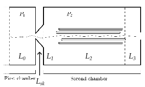
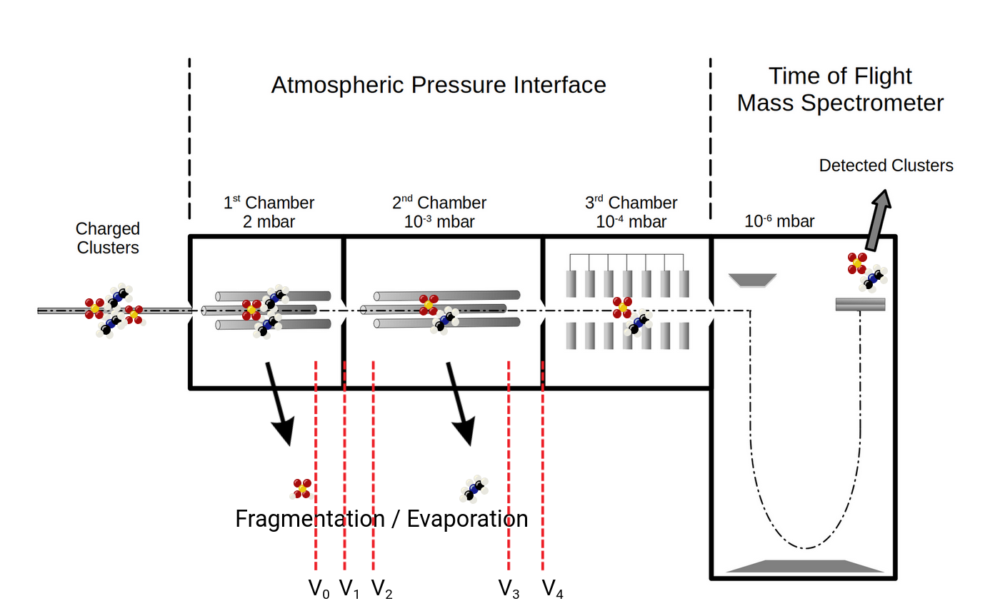

# Configuration

This page acts as a reference for configuration files.
Note that much of the same structure is used [by the Python library](python.md).

Here's an example of a full configuration file used in the validation example (available in the repository at `examples/validation`).
You will probably want to skim this, but can come back after reading the sections below.

``` title="examples/validation/config.toml"
--8<-- "examples/validation/config.toml"
```

Note there are two main things configured in this file.
The first is how to ingest things, as given by one or more `[[pathways]]` sections.
The second is how to run the simulation, as given by the `[default_config]` section and one or more `[[config]]` sections.

## Ingestion configuration

See the documentation for the [apitofsim db prepare][apitofsim-db-prepare] command to get started.
Here some more extra reference information about `type = "csv"` ingestion is given.

### [[pathways]]

We can start with ingestion parameters like so:

```toml
[[pathways]]
type = "csv"
```

| Name            | Description                           |
| --------------- | --------------------------------------|
| type            | Set to "csv" here. See the help page for [apitofsim db prepare][apitofsim-db-prepare] for "legacy_glob". |
| pathways_path   | A path, given either as absolute or relative to the .toml to the pathways CSV |
| clusters_path   | A path, given either as absolute or relative to the .toml to the clusters CSV |

### [[pathways.clusters]]

Next is a section `[pathways.clusters]` consisting firstly of top level keys referencing one or more sources by their name, each of which is specified secondly as `[pathways.clusters.sources.SOURCE_NAME]` where `SOURCE_NAME` is a name of your choice.

#### [[pathways.clusters.source.SOURCE_NAME]]

The `SOURCE_NAME` will be used as the name of a column of the clusters CSV file given by `clusters_path` which will contain for each cluster the location of the file to import its data from. Alternatively in case several sources have a common prefix, a `prefix` column can be given and each starting with the prefix can specify and extension with `append_to_common_prefix`.

| Name            | Description                           |
| --------------- | --------------------------------------|
| type            | This can be "csv", "gaussian", "map", "orca" or "xyz". If not specified `SOURCE_NAME` will be used. |
| append_to_common_prefix | This is a string such as ".out" to append to the `prefix` column of the clusters CSV. |
| ignore_unicode_errors | This can be set to `true` to skip over invalid characters in poorly encoded or corrupted files |

Types `"csv"` and `"map"` allow setting specific values inline, which can be useful, e.g. for overriding specific quantities.
For `"map`" cluster names can be given as keys of `[[pathways.clusters.source.SOURCE_NAME]]` and values can be given inline.
For `"csv"`, new columns can be added to the clusters CSV named after the corresponding `"ATTRIBUTE"`.

#### [[pathways.clusters.ATTRIBUTE]]

| Name                     | Description                           |
| ------------------------ | --------------------------------------|
| default_source           | The source to be used for any attributes not specified. |
| number_of_atoms          | The number of atoms in the compound. This is currently only used to determine whether a compound is an atom-like product and therefore does not need to have vibrational_temperatures specified. |
| vibrational_temperatures | The vibrational temperatures of the compound. |
| rotational_temperatures  | The rotational temperatures of the compound. |
| electronic_energy        | The electronic energy of the compound. |
| atomic_mass              | The atomic mass of the compound. |
| charge                   | The charge of the compound. |
| ase                      | Where to obtain the ASE `Atoms` object from the cluster to insert into an ASE database. Needed only if `--ase` is specified when running [apitofsim db prepare][apitofsim-db-prepare]`. |

Each of these attributes can be either as `"SOURCE_NAME"` or as an arithmetic expression (using Python syntax) e.g. `"SOURCE_NAME.attribute1 + SOURCE_NAME.attribute2"`.

## Simulation parameters

For the simulation parameters, you can specify one or more `[[configs]]` sections, each with a `name` field and the values of all parameters.

You can put common parameters in the `default_config` section, so that each `[[configs]]` section inherits these as overridable defaults.

For parameters with units, a unit must be given.
Internally [pint](https://pint.readthedocs.io/en/stable/) is used to convert into the preferred units for the simulation, so you can specify any unit with the correct dimensions.
For scalars, units can be expressed either as a string (e.g. `1.0 meter`) or as an array of two elements, where the first element is the value and the second element is the unit (e.g. `[1.0, "meter"]`).
For arrays, the second for should be used e.g. `[[1.0, 2.0], "meter"]`.

For the following example, say we have a start a simulation parameters section like so:

```toml
[[configs]]
name = "myconfig"
```

### Top level scalars

| Name            | Typical unit | Description                          |
| --------------- | -------------|--------------------------------------|
| N_iter          | -            | Number of iterations to run initial grid search when performing root finding of the area-velocity equation when making histogrammed quasi-one-dimensional isentropic nozzle flow calculation for the skimmer |
| M_iter          | -            | Number of secant steps to perform when performing root finding of the area-velocity equation when making histogrammed quasi-one-dimensional isentropic nozzle flow calculation for the skimmer |
| tolerance       | -            | Tolerance when performing root finding of the area-velocity equation when making histogrammed quasi-one-dimensional isentropic nozzle flow calculation for the skimmer |
| resolution      | -            | Number of points to use when histogramming across length of the skimmer region (as specified in lengths) |
| N               | -            | Number of realizations to use in main particle simulation |
| bin_width       | kelvin       | Bin width for histogramming density of states and k_total |
| energy_max      | kelvin       | Maximum energy to consider when histogramming density of states. The density of states must be evaluated up to an energy equal or greater to the to the sum of energy_max_rate and the maximum fragmentation energy you will simulate a pathway for. |
| energy_max_rate | kelvin       | Maximum energy to consider when histogramming k_total |
| alpha_factor    | halfturn     | Angle of skimmer |
| T               | kelvin       | Temperature inside the mass spectrometer |
| dc              | meter        | Radius at smallest cross section of skimmer |
| radius_pinhole  | meter        | Radius of the pinhole at the end of the mass spectrometer. This is optional and if ommited, this part to the simulation will be ignored, i.e. collisions with gas molecules will not undergo extra checks. |

### Top level arrays

<figure markdown="span">
  { width="300" }

<figcaption>Figure showing how the lengths and pressures correspond to different sections of APi-ToF mass spectrometer</figcaption>
</figure>

<figure markdown="span">
  { width="300" }

<figcaption>Figure showing where the voltages are applied on an APi-ToF mass spectrometer</figcaption>
</figure>

| Name            | Typical unit | Description                          |
| --------------- | -------------|--------------------------------------|
| pressures       | pascal       | A two element array of the pressures in the first and second chamber, respectively [$P_1$, $P_2$] |
| ... $P_1$       | meter        | Pressure in 1st chamber |
| ... $P_2$       | meter        | Pressure in 2nd chamber |
| lengths         | meter        | A five element array with the important dimensions of the instrument [$L_0$, $L_1$, $L_2$, $L_3$, $L_{sk}$] |
| ... $L_0$       | meter        | Length of 1st chamber |
| ... $L_1$       | meter        | Length between skimmer and front quadrupole |
| ... $L_2$       | meter        | Length between front quadrupole and back quadrupole |
| ... $L_3$       | meter        | Length between back quadrupole and 2nd skimmer |
| ... $L_{sk}$    | meter        | Length of skimmer |
| voltages        | volt         | A five element array with the voltages applied to the instrument [$V_0$, $V_1$, $V_2$, $V_3$, $V_4$] |
| ... $V_0$       | volt         | Voltage at then end of the quadrupole in first chamber (not currently simulated) |
| ... $V_1$       | volt         | Voltage between first and second chambers |
| ... $V_2$       | volt         | Voltage at beginning of quadrupole in second chamber |
| ... $V_3$       | volt         | Voltage at end of quadrupole in second chamber |
| ... $V_4$       | volt         | Voltage at end of second chamber |

### The gas section

For example:

```toml
[[configs.gas]]
radius = "1.84e-10 meter"
mass = "4.65e-26 kilogram"
= 1.4
```

| Name            | Typical unit | Description                          |
| --------------- | -------------|--------------------------------------|
| radius          | meter        | The radius of the gas particle |
| mass            | kilogram     | The mass of the gas particle |
| adiabatic_index | -            | The adiabatic index of the gas |

### The quadrupole section

This section is optional. If not specified, the simulation will be run without a quadrupole.

For example:

```toml
[configs.quadrupole]
dc_field = "0.0 volt"
ac_field = "200.0 volt"
radiofrequency = "1.3e6 Hz"
r_quadrupole = "6.0e-3 meter"
```

| Name            | Typical unit | Description                          |
| --------------- | -------------|--------------------------------------|
| dc_field        | volt         | DC field at the quadrupole |
| ac_field        | ac_field     | AC field at the quadrupole |
| radiofrequency  | hertz        | Radio frequency |
| r_quadrupole    | meter        | Half-distance between quadrupole rods |

## Legacy configuration (.in file)

This format is order dependent and its usage is not recommended.

An example is reproduced here for reference:

``` title="config.in"
--8<-- "inputs/example/config.in"
```

